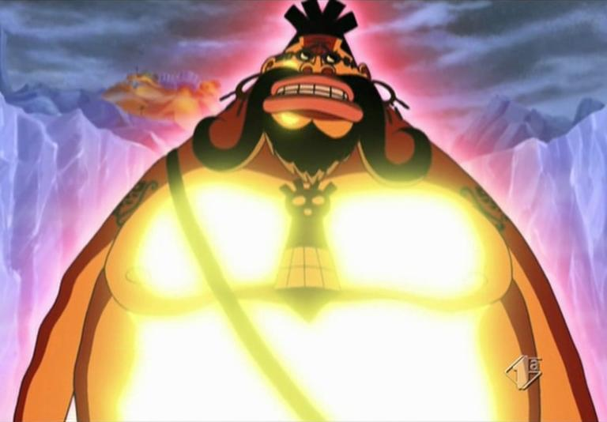

# ONE_Furnance_kata

kata realizado para practicar el patron Singleton.

---

## Funcionamiento

El funcionamiento es que mientras la temperatura de la aplicacion sea menor que la temperatura maxima marcada , va a estar calentado. Cuando la temperatura este en la maxima se apaga y así cunado vuelva a estar bajo la minima se vuelve a encender.

### Class pirate

Dado que en el ejercicio proporcionado nos daban una clase Jedi , yo decidí implementar una clase Pirata aparte , ya que se usaba al Jedi para calentar.

En el arco de One Piece "Ice Hunter" cap 326 - 336 Aparece un Usuario con la fruta "Atsu Atsu no mi", Accino , haciendo que el usuario pudiera calentar su cuerpo hasta los 10 000 grados. Quien si no cansado de su vida de cazarrecompensas accedio para ser el calentador , de ahí el ataque que se muestra en pantalla cuando caliente.

Cuando hay mucho calor decide apagarse asi que decidimos poner al compa Kuzan , que es el encargado de enfriar todo con el poder de la fruta "Hie Hie no Mi" usando su ataque "Ice Age" Para enfriar un poco el asunto.

